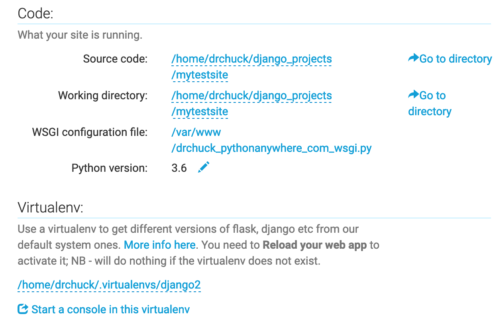

# Installing Django on Python Anywhere 

https://www.dj4e.com/assn/dj4e_install.md?PHPSESSID=b719812919d32f145a2b8940fc761666 


## Setting Up Your Environment
Once you have created your PYAW account, start a bash shell and set up a virtual environment with Python 3.x and Django 4.2.
```sh
mkvirtualenv django42 --python=/usr/bin/python3.9
pip install django==4.2.7 ## this may take a couple of minutes
```

Sometimes these two commands take a long time. Run them one at a time in the shell. When the servers are running slowly, each command can take more than ten minutes to finish. Be patient and wait until you see the $ prompt indicating the command is complete before continuing.

Note if you exit and re-start a new shell on PythonAnywhere - you need the following command to get back into your virtual environment in the new bash shell unless you enable it automatically as shown below

```sh
workon django42
```

Lets make sure that your django was installed successfully and you are running the right version of Python with the following commands:
```sh
python --version
# This should show something like Python 3.9.5
python -m django --version
# This should show something like 4.2.7
```


## Automatically Enabling Your Virtual Environment

Each time you start a new shell, you will need to activate your virtual environment. It is a lot simpler to do this automatically every time you login by editing the .bashrc file in your home directory.
```sh
# /home/(your-account)/.bashrc
/home/awfdj4e/.bashrc
```

**Look for lines near the end of the file that look like:**
```sh
# Load virtualenvwrapper
source virtualenvwrapper.sh &> /dev/null
```

**Add the following lines to the file and save the file.**
```sh
# Auto switch into django42 virtual environment
workon django42

echo "Hi Thomas!"
```

The next time you start a console/shell, the shell should be using the django42 environment and you should see the virtual environment indicator in your shell prompt:
```sh
(django42) 13:29 ~ $
```


## Installing the Sample Code for DJ4E
Lets also get a copy of the sample code for DJ4E checked out so you can look at sample code as the course progresses and install some important additional Django software libraries using pip.
https://samples.dj4e.com/ 

```sh
cd ~
git clone https://github.com/csev/dj4e-samples
cd ~/dj4e-samples
pip install -r requirements42.txt
```
The pip command can also take a few minutes to complete. Once it finishes and you get the $ prompt again, check for a good instlal by running:
```sh
cd ~/dj4e-samples
python manage.py check
```
This is the normal output of running check:
```sh
When you want to use social login, please see dj4e-samples/github_settings-dist.py
Using registration/login.html as the login template
System check identified no issues (0 silenced).
```

## If you see a SyntaxError
If the check identifies errors, do not go on to the rest of the assignment once you can run check and there are no errors. If you see this error:
```sh
python manage.py check
  File "manage.py", line 17
    ) from exc
         ^
SyntaxError: invalid syntax
```

Do not edit your `manage.py` file - the problem is never in that file.

There are several possible reasons for this:

1. It can mean that you are not running in the virtual environment (workon django42) and mistakenly running Python 2 instead of Python 3. There is no error in manage.py - it is valid Python 3 syntax that confuses Python 2.

2. It can mean that you have edited your manage.py file and have introduced a syntax error. Take a look at this screen shot of a working manage.py and check if there are any differences. While you are there you can change line 1 from 'python' to 'python3' and the syntax error indication will go away. Often the mistakes are on the indentation of lines 16 and 17. Check and match the indentation in the screen shot exactly.

## When running 'check' works
Once the check works do:
```sh
python manage.py makemigrations
```
This is the normal output of the makemigrations:
```sh
When you want to use social login, please see dj4e-samples/github_settings-dist.py
Using registration/login.html as the login template
No changes detected
```sh
python manage.py migrate
```

If you are doing this for the first time, it should run some migrations and create a file db.sqlite3.

The `dj4e-samples` folder is reference material that you can use through out the course. From time to time we might make changes to this and ask you to do a git pull to get the latest version of the code.


## Building Your Application

Now that we have your Django set up and you have retrieved the sample code for DJ4E, lets build your first application in the PYAW shell:
```sh
cd ~
mkdir django_projects
```
Once you have made a folder in your home directory, lets go into that folder and make a Django project.
```sh
cd ~/django_projects

# starting an empty django app
django-admin startproject mysite
```
At this point, keep your shell open in one tab and open the PythonAnywhere Files application in another browser tab and navigate to the ~/django_projects/mysite/mysite/settings.py and change the allowed hosts line (around line 28) to be:
```sh
ALLOWED_HOSTS = [ '*' ]
```
Leave the `DEBUG value set to True` - we are not really "in production" and if you set this to False you will not see error messages when you make mistakes.

Then save the file. Do not "Run" the file - just save it - it will be loaded later.


## Running Your Application
Now that we have built your first application, we need to tell PythonAnywhere where to look to run your application as a web server so you can test it.

- In the `PYAW web interface` navigate to the Web tab to create a new web application. 
- You do not need to upgrade your account 
   - they give you one application like username.pythonanywhere.com - use this free application for the course.
  
- When making the new application, do not create a `"Django application"` 
  - -> instead, 
  - select manual configuration and match the Python version to the version that you used in your virtual environment above. 
  - Once the webapp is created, you need to make a few changes to the settings for the web app and your application.
```sh
pwd 
/home/awfdj4e/django_projects/

# Source code:
# /home/drchuck/django_projects/mysite
/home/awfdj4e/django_projects/mysite

#Working directory: 
# /home/drchuck/django_projects/mysite
/home/awfdj4e/django_projects/mysite


#Virtualenv: 
# /home/drchuck/.virtualenvs/django42
/home/awfdj4e/.virtualenvs/django42
```
Replace `drchuck` with your account on PythonAnywhere.

Note that once you have your Virtualenv set up you have a very convenient link titled "Start a console in this virtualenv" - this is a great way to open up consoles so you never have to type `"workon django42"` and it makes sure your virtual envronment is properly set up and configured. Sample image



**Edit - WGSI Configuration File** 
Then edit the `WGSI Configuration` File and put the following code into it. Make sure to delete the existing content of the WGSI Configuration File file and completely replace it with the text below. This is slightly different from the sample in the PythonAnywhere tutorial.
```py
import os
import sys

path = os.path.expanduser('~/django_projects/mysite')
if path not in sys.path:
    sys.path.insert(0, path)
os.environ['DJANGO_SETTINGS_MODULE'] = 'mysite.settings'
from django.core.wsgi import get_wsgi_application
from django.contrib.staticfiles.handlers import StaticFilesHandler
application = StaticFilesHandler(get_wsgi_application())
```

Once the above configuration is complete, go back to the top of the PYAW Web tab, `Reload your web application` wait a few seconds and check that it is up and visiting the URL for your application shown in in the Web tab on PYAW like:
```sh
# http://(your-account).pythonanywhere.com/
https://awfdj4e.pythonanywhere.com/ 
```

**Note** : Just as a note, you never run the `runserver command` on PythonAnywhere.
```sh
python manage.py runserver
```

If you try to do runserver on PythonAnywhere it, you will see an error message like this
```sh
00:26 ~/django_projects/mysite (master)$ python manage.py runserver

Watching for file changes with StatReloader
Performing system checks...
System check identified no issues (0 silenced).
September 14, 2021 - 00:26:16
Django version 2.2.7, using settings 'mysite.settings'
Starting development server at http://127.0.0.1:8000/
Quit the server with CONTROL-C.
Error: That port is already in use.
00:26 ~/django_projects/mysite (master)$
```
This will never work on PythonAnywhere. You run / restart your server on PythonAnywhere using the "reload" button on your Web tab. So if you are reading any Django instructions that say to do a runserver, instead do a check and then reload the application in the PythonAnywhere web UI.


## Adding Your Polls Application
At this point, you can add the polls application from the first Django tutorial. We are jumping into the middle of this tutorial because the first part of the tutorial is installing and configuring Django in general.

Start at the step where we make the polls application:
```sh
cd ~/django_projects/mysite
python manage.py startapp polls
```

Continue to follow the steps outlined in `Django tutorial`
`https://docs.djangoproject.com/en/4.2/intro/tutorial01/#creating-the-polls-app` 

until you reach the part where the tutorial tells you to run this command:
```sh
python manage.py runserver     # <-- Never run this on pythonanywhere
```

Do not run the runserver command on PythonAnywhere. `Instead` run the following command:
```sh
python manage.py check
```

The `check` does a check for syntax and logic errors in your Django application. It is easier to fix errors in the command line.

And `when there are no errors`, you are done with the Django Tutorial, come back to these instructions - and navigate to the Web tab in Python anywhere and Reload your application and then test your application by navigating to:


## Starting Over Fresh
If you have followed instructions and it just does not work and you want to start over at the beginning of this assignment, here are the steps to clear things out:

Remove all of your running consoles under the www.pythonanywhere.com Consoles tab

Open a new bash console from the Consoles tab. Do not run the workon command and run the following commands:

```sh
cd ~
rm -rf .virtualenvs/django42
rm -rf dj4e-samples
rm -rf django_projects
```

Then go to the Web tab on www.pythonanywhere.com and Reload your application. It may give you errors - this is OK. We just want to make sure that no processes are left hanging on to old files.
Then close your console, and delete it under the Consoles tab and go up to the very beginning of this handout and start over.

We did not remove any of the configuration changes under the Web tab - so as you re-create all the files, parts of the Web tab may just start working when you Reload your application.