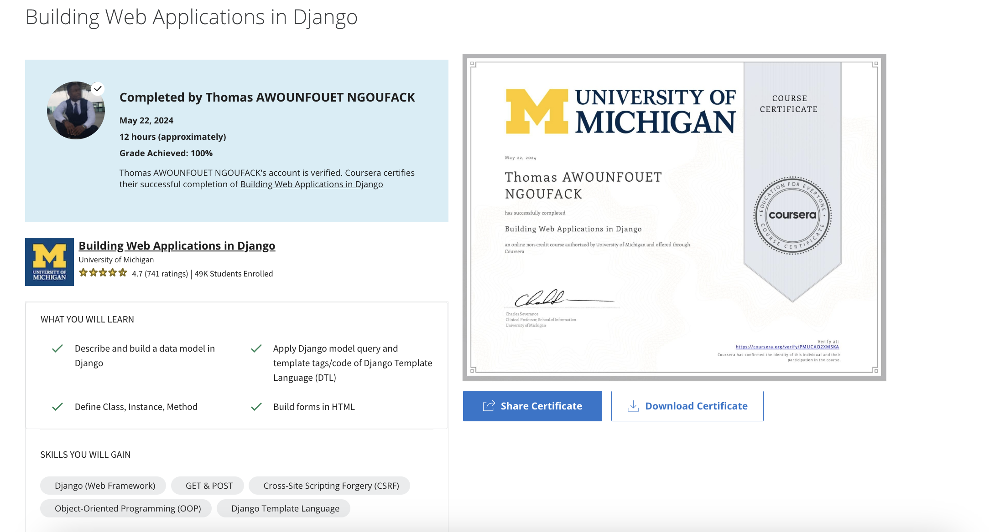

# Building Web App in Django 

## Week 1 - Data Models 
This section explores how we define `models` in Django and then we build the data models and explore the administration interface for our application. Data models are how Django interacts with the underlying database to store and retrieve data.

**Learning Objectives**
- Define “Model”, “View”, and “Controller” (MVC) in Django
- Describe the overall structure of a Django application
- Build a data model in Django
- Explain how migration works in Django
- Explore model admin interface

## Week 2 - Django Views
`Views` are the aspect of Django applications that produce the web pages that are shown to our users. Views are one of several core elements of Django applications.

**Learning Objectives** 
- Explain why views are the core of Django applications
- Give examples of built-in Django template tags and filters and their use
- Apply Django model query to retrieve items
- Apply template tags and code of Django Template Language (DTL)
- Describe Don’t Repeat Yourself (DRY) principle

### Django Tutorial 03
https://www.dj4e.com/tools/dj-tutorial/?PHPSESSID=3d5afa4104b9a32f4b5af33da56ba69a 

For this assignment work through Part 3 of the Django tutorial at https://docs.djangoproject.com/en/4.2/intro/tutorial03/.

- To receive a grade for this assignment, include this string 6742bca8 on the pages of your application.
- Add the following to your mysite/polls/views.py with the required information above.

## Week 3 - Django Generics Views
We review Python Object Orientation and look at the generic views capability within Django. We use generic views by extending Django classes to make a new view class.

**Learning Objectives**
- Explore generic views capability in Django
- Explain why Object Oriented programming is a structured approach to code reuse
- Describe Convention Over Configuration design paradigm
- Define terminologies including Class, Instance, and Method

## Week 4 - Forms in HTTP and HTML
We cover how GET and POST work, how forms are constructed from HTML, how we protect our applications against Cross-Site Scripting Forgery (CSRF), and how we handle browser refreshes after POST.

**Learning Objectives**
- Describe how GET and POST send parameters to the web server
- Build forms in HTML
- Explain a Cross-Site Scripting Forgery (CSRF) attack and a CSRF defense
- Address issues in browser refreshes when POST requests happen

### Django Tutorial 04
https://www.dj4e.com/tools/dj-tutorial/?PHPSESSID=3f0eb86a490be131cd2d09bacc6bd3ed 
For this assignment work through Part 4 of the Django tutorial at https://docs.djangoproject.com/en/4.2/intro/tutorial04/.

To receive a grade for this assignment, include this string 6742bca8 on the pages of your application.

